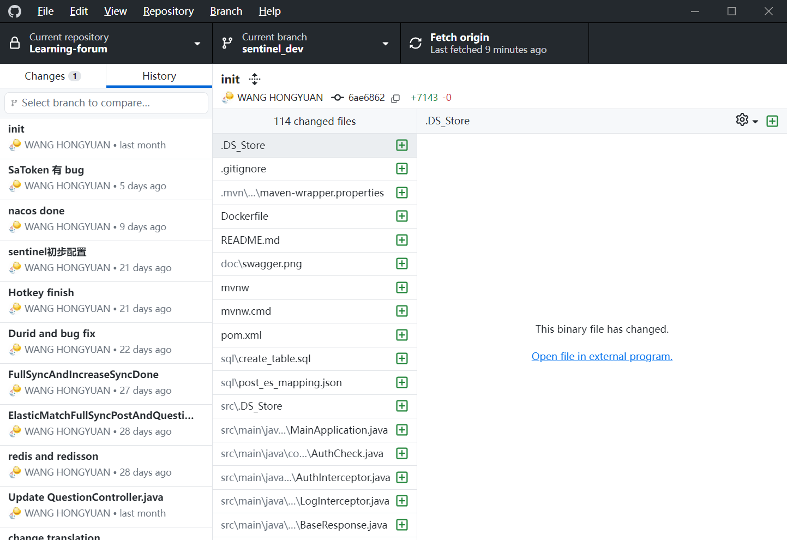
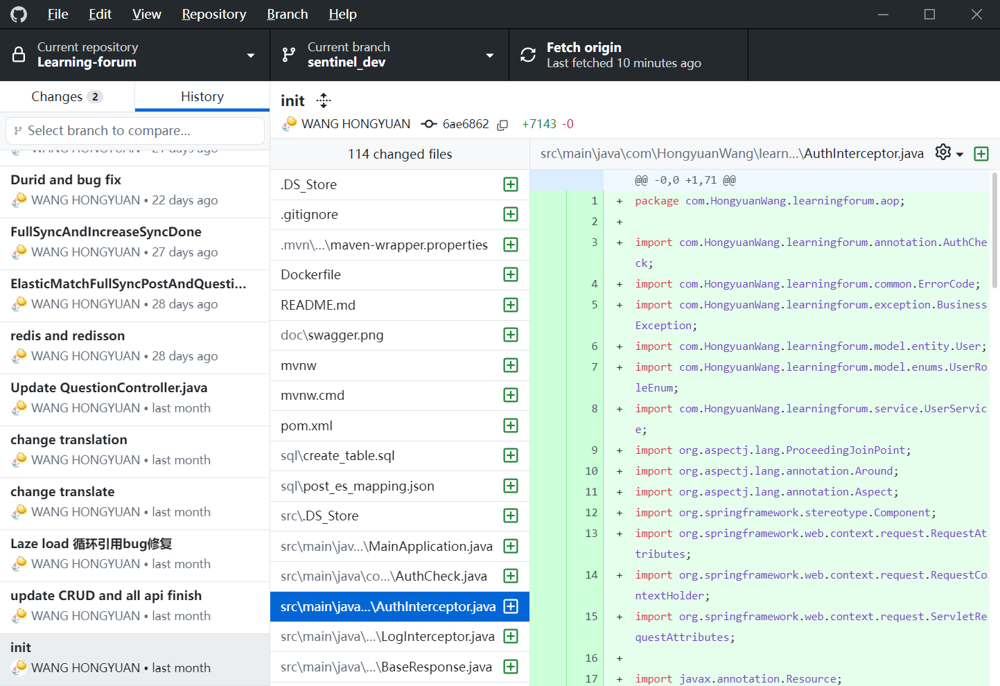
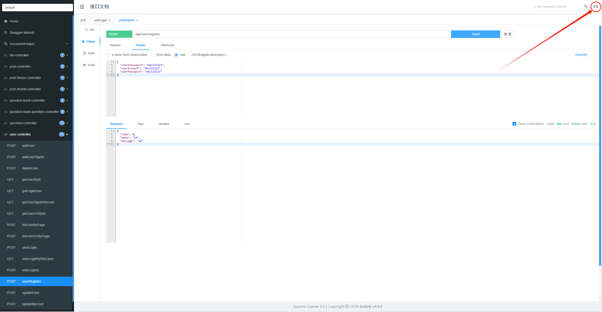
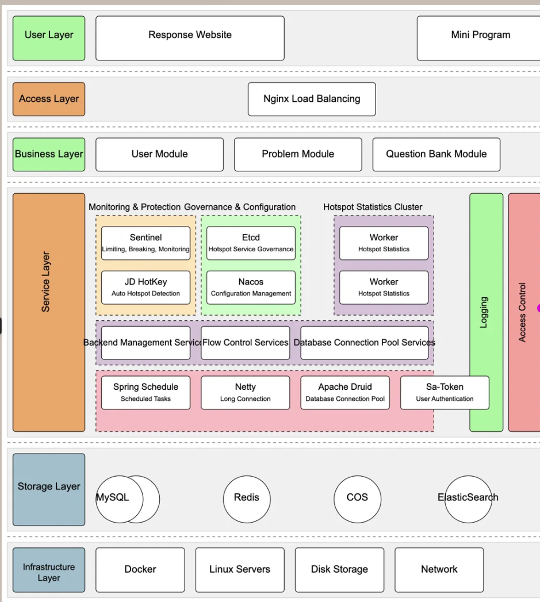

# SpringBoot 学习论坛项目文档 - 作业3

<div align="center">
  
  <h3>专业的学习资源交流社区</h3>
  <p>基于 Java SpringBoot 的全功能论坛系统，整合了主流技术栈与企业级性能优化</p>
</div>

## 📚 项目概述
**项目名称**：SpringBoot LearningForum —— 已通过腾讯云部署服务器
**备注**：由于作业中展示需求，不得不将服务器接口文档等信息明文放入此文件中，因此不保证在您评分的时候服务器仍在运行，服务器有被攻击而无法使用的可能。
**作者**：Hongyuan Wang  

**项目演示**：[接口文档](http://43.165.196.25/api/doc.html#/home) 接口文档账号：root 密码：Why20020721

## 🚀 核心亮点

- **高性能架构**：多级缓存设计、热点数据探测、限流熔断保护
- **企业级安全**：RBAC权限体系、防爬虫策略、动态黑名单
- **全文检索**：基于Elasticsearch的分词搜索，支持复杂查询条件
- **高效开发**：自定义代码生成器，遵循阿里Java编码规范
- **全面测试**：JUnit5单元测试
- **云原生支持**：支持容器化部署，多环境配置

## 🔨 技术栈与特性

### 主流框架 & 特性
- **Spring Boot 2.7.x**：核心框架，提供自动配置和快速开发能力
- **Spring MVC**：Web开发框架，处理HTTP请求
- **MyBatis + MyBatis Plus**：ORM框架，简化数据访问
  - 集成MyBatisX插件，支持一键生成CRUD代码
  - 开启分页功能，支持高效的数据分页查询
- **Spring AOP**：面向切面编程，用于日志记录、权限校验等横切关注点
- **Spring Scheduler**：定时任务框架，用于数据同步、缓存更新等
- **Spring 事务管理**：通过注解实现声明式事务，保证数据一致性

### 数据存储方案
- **MySQL**：关系型数据库，存储核心业务数据
  - 自定义索引优化，提升查询性能
  - Druid连接池监控，实时发现慢SQL
- **Redis**：内存数据库
  - 分布式Session存储，支持集群部署
  - 热点数据缓存，减轻数据库压力
  - BitMap实现高效数据统计
  - Lua脚本保证原子操作
- **Elasticsearch**：搜索引擎
  - 自定义分词器，提升搜索准确性
  - 动静分离策略，减少数据同步成本
  - 定时增量同步机制
- **腾讯云 COS**：对象存储，用于文件上传和CDN加速

### 工具与库
- **Easy Excel**：高效的Excel处理库，支持大文件导入导出
- **Hutool**：Java工具集，提供丰富的工具方法
- **Apache Commons Lang3**：Java基础工具类库
- **Lombok**：通过注解简化JavaBean开发
- **Caffeine**：本地缓存库，提供JVM级别的高速缓存
- **HotKey**：热点数据探测，自动缓存热门访问内容
- **Redisson**：分布式锁和富集的Redis客户端

### 安全与性能优化
- **Sa-Token**：轻量级权限认证框架
  - 实现同端互斥登录，防止账号共享
  - 基于RBAC的权限控制
- **Sentinel**：流量控制和熔断降级
  - 接口限流保护
  - 热点参数限流
  - 服务熔断，自动降级
- **自定义反爬策略**：
  - 基于Redis的访问频率统计
  - Lua脚本实现原子计数
  - 动态黑名单机制
- **Nacos**：服务配置中心
  - 动态更新系统配置
  - 实时调整黑白名单

### 开发与调试工具
- **Swagger + Knife4j**：API文档生成与测试
- **自定义代码生成器**：一键生成Service、Controller、实体类代码
- **Spring Boot Devtools**：热部署，提升开发效率
- **Logback**：日志框架，支持多环境日志配置

## GIT记录与接口文档





## 🌟 业务功能

### 用户系统
- 登录、注册、注销、个人信息更新
- 基于Sa-Token的权限管理
- 微信开放平台登录集成
- 同端互斥登录机制

### 论坛核心功能
- **帖子管理**：
  - 创建、删除、编辑、更新帖子
  - 数据库和ES双重检索机制
  - 标签系统，支持多维度分类
- **互动系统**：
  - 点赞/取消点赞功能
  - 收藏/取消收藏功能
  - 用户评论系统
  - 帖子浏览统计
- **搜索系统**：
  - 基于ES的全文检索
  - 支持标题、内容、标签的多条件搜索
  - 搜索结果高亮显示
  - 搜索推荐功能

### 内容运营
- 帖子数据同步机制：
  - 全量同步ES任务
  - 增量同步ES定时任务
- 文件上传系统：
  - 支持按业务分类的文件上传
  - 支持图片、文档等多种类型
  - 自动生成缩略图


### 环境要求
- JDK 1.8+
- Maven 3.6+
- MySQL 5.7+
- Redis 6.0+
- Elasticsearch 7.x (可选)
- 腾讯云账号 (可选，用于对象存储)

### 本地开发环境搭建

#### 1. 克隆项目
```bash
git clone https://github.com/HongyuanWang/SpringBoot-LearningForum.git
cd SpringBoot-LearningForum
```

#### 2. MySQL 数据库配置
1. 修改 `application.yml` 的数据库配置：
```yaml
spring:
  datasource:
    driver-class-name: com.mysql.cj.jdbc.Driver
    url: jdbc:mysql://localhost:3306/learning_forum
    username: root
    password: 123456
```

2. 执行 `sql/create_table.sql` 中的数据库语句，自动创建库表

3. 启动项目，访问 http://localhost:8101/api/doc.html 即可打开接口文档，不需要写前端就能在线调试接口

#### 3. Redis 分布式登录配置
1. 修改 `application.yml` 的 Redis 配置：
```yaml
spring:
  redis:
    database: 1
    host: localhost
    port: 6379
    timeout: 5000
    password: 123456
```

2. 修改 `application.yml` 中的 session 存储方式：
```yaml
spring:
  session:
    store-type: redis
```

#### 4. Elasticsearch 搜索引擎配置
1. 修改 `application.yml` 的 Elasticsearch 配置：
```yaml
spring:
  elasticsearch:
    uris: http://localhost:9200
    username: root
    password: 123456
```

2. 复制 `sql/post_es_mapping.json` 文件中的内容，通过调用 Elasticsearch 的接口或者 Kibana Dev Tools 来创建索引（相当于数据库建表）：
```
PUT post_v1
{
  参数见 sql/post_es_mapping.json 文件
}
```

3. 开启同步任务，将数据库的帖子同步到 Elasticsearch：找到 job 目录下的 `FullSyncPostToEs` 和 `IncSyncPostToEs` 文件，取消掉 `@Component` 注解的注释，再次执行程序即可触发同步：
```java
// todo 取消注释开启任务
//@Component
```

#### 5. 腾讯云 COS 配置 (可选)
1. 在 `application.yml` 中配置腾讯云 COS 相关参数：
```yaml
cos:
  client:
    accessKey: accessKey
    secretKey: secretKey
    region: ap-guangzhou
    bucket: your-bucket-name
```

### 业务代码生成器使用
支持自动生成 Service、Controller、数据模型代码，配合 MyBatisX 插件，可以快速开发增删改查等实用基础功能。

找到 `generate.CodeGenerator` 类，修改生成参数和生成路径，并且支持注释掉不需要的生成逻辑，然后运行即可：
```java
// 指定生成参数
String packageName = "com.HongyuanWang.learningforum";
String dataName = "用户评论";
String dataKey = "userComment";
String upperDataKey = "UserComment";
```

生成代码后，可以移动到实际项目中，并且按照 // todo 注释的提示来针对自己的业务需求进行修改。

## 🏗️ 项目架构

### 系统架构图


### 代码结构
```
F:\GITCODEHERE\LEARNING-FORUM\SRC
|   .DS_Store
|
+---main
|   +---java
|   |   +---com
|   |   |   \---HongyuanWang
|   |   |       \---learningforum
|   |   |           |   MainApplication.java
|   |   |           |
|   |   |           +---annotation
|   |   |           |       AuthCheck.java  
|   |   |           |
|   |   |           +---aop
|   |   |           |       AuthInterceptor.java
|   |   |           |       LogInterceptor.java
|   |   |           |
|   |   |           +---blackfilter
|   |   |           |       BlackIpFilter.java
|   |   |           |       BlackIpUtils.java
|   |   |           |       NacosListener.java
|   |   |           |
|   |   |           +---common
|   |   |           |       BaseResponse.java
|   |   |           |       DeleteRequest.java
|   |   |           |       ErrorCode.java
|   |   |           |       PageRequest.java
|   |   |           |       ResultUtils.java
|   |   |           |
|   |   |           +---config
|   |   |           |       CorsConfig.java
|   |   |           |       CosClientConfig.java
|   |   |           |       HotKeyConfig.java
|   |   |           |       JsonConfig.java
|   |   |           |       MyBatisPlusConfig.java
|   |   |           |       RedissonConfig.java
|   |   |           |       WxOpenConfig.java
|   |   |           |
|   |   |           +---constant
|   |   |           |       CommonConstant.java
|   |   |           |       FileConstant.java
|   |   |           |       RedisConstant.java
|   |   |           |       UserConstant.java
|   |   |           |
|   |   |           +---controller
|   |   |           |       FileController.java
|   |   |           |       PostController.java
|   |   |           |       PostFavourController.java
|   |   |           |       PostThumbController.java
|   |   |           |       QuestionBankController.java
|   |   |           |       QuestionBankQuestionController.java
|   |   |           |       QuestionController.java
|   |   |           |       UserController.java
|   |   |           |       WxMpController.java
|   |   |           |
|   |   |           +---esdao
|   |   |           |       PostEsDao.java
|   |   |           |       QuestionEsDao.java
|   |   |           |
|   |   |           +---exception
|   |   |           |       BusinessException.java
|   |   |           |       GlobalExceptionHandler.java
|   |   |           |       ThrowUtils.java
|   |   |           |
|   |   |           +---generate
|   |   |           |       CodeGenerator.java
|   |   |           |
|   |   |           +---job
|   |   |           |   +---cycle
|   |   |           |   |       IncSyncPostToEs.java
|   |   |           |   |       IncSyncQuestionToEs.java
|   |   |           |   |
|   |   |           |   \---once
|   |   |           |           FullSyncPostToEs.java
|   |   |           |           FullSyncQuestionToEs.java
|   |   |           |
|   |   |           +---manager
|   |   |           |       CosManager.java
|   |   |           |       CounterManager.java
|   |   |           |
|   |   |           +---mapper
|   |   |           |       PostFavourMapper.java
|   |   |           |       PostMapper.java
|   |   |           |       PostThumbMapper.java
|   |   |           |       QuestionBankMapper.java
|   |   |           |       QuestionBankQuestionMapper.java
|   |   |           |       QuestionMapper.java
|   |   |           |       UserMapper.java
|   |   |           |
|   |   |           +---model
|   |   |           |   +---dto
|   |   |           |   |   +---file
|   |   |           |   |   |       UploadFileRequest.java
|   |   |           |   |   |
|   |   |           |   |   +---post
|   |   |           |   |   |       PostAddRequest.java
|   |   |           |   |   |       PostEditRequest.java
|   |   |           |   |   |       PostEsDTO.java
|   |   |           |   |   |       PostQueryRequest.java
|   |   |           |   |   |       PostUpdateRequest.java
|   |   |           |   |   |
|   |   |           |   |   +---postfavour
|   |   |           |   |   |       PostFavourAddRequest.java
|   |   |           |   |   |       PostFavourQueryRequest.java
|   |   |           |   |   |
|   |   |           |   |   +---postthumb
|   |   |           |   |   |       PostThumbAddRequest.java
|   |   |           |   |   |
|   |   |           |   |   +---question
|   |   |           |   |   |       QuestionAddRequest.java
|   |   |           |   |   |       QuestionBatchDeleteRequest.java
|   |   |           |   |   |       QuestionEditRequest.java
|   |   |           |   |   |       QuestionEsDTO.java
|   |   |           |   |   |       QuestionQueryRequest.java
|   |   |           |   |   |       QuestionUpdateRequest.java
|   |   |           |   |   |
|   |   |           |   |   +---questionBank
|   |   |           |   |   |       QuestionBankAddRequest.java
|   |   |           |   |   |       QuestionBankEditRequest.java
|   |   |           |   |   |       QuestionBankQueryRequest.java
|   |   |           |   |   |       QuestionBankUpdateRequest.java
|   |   |           |   |   |
|   |   |           |   |   +---questionBankQuestion
|   |   |           |   |   |       QuestionBankQuestionAddRequest.java
|   |   |           |   |   |       QuestionBankQuestionBatchAddRequest.java
|   |   |           |   |   |       QuestionBankQuestionBatchRemoveRequest.java
|   |   |           |   |   |       QuestionBankQuestionQueryRequest.java
|   |   |           |   |   |       QuestionBankQuestionRemoveRequest.java
|   |   |           |   |   |       QuestionBankQuestionUpdateRequest.java
|   |   |           |   |   |
|   |   |           |   |   \---user
|   |   |           |   |           UserAddRequest.java
|   |   |           |   |           UserLoginRequest.java
|   |   |           |   |           UserQueryRequest.java
|   |   |           |   |           UserRegisterRequest.java
|   |   |           |   |           UserUpdateMyRequest.java
|   |   |           |   |           UserUpdateRequest.java
|   |   |           |   |
|   |   |           |   +---entity
|   |   |           |   |       Post.java
|   |   |           |   |       PostFavour.java
|   |   |           |   |       PostThumb.java
|   |   |           |   |       Question.java
|   |   |           |   |       QuestionBank.java
|   |   |           |   |       QuestionBankFavour.java
|   |   |           |   |       QuestionBankQuestion.java
|   |   |           |   |       QuestionBankThumb.java
|   |   |           |   |       User.java
|   |   |           |   |
|   |   |           |   +---enums
|   |   |           |   |       FileUploadBizEnum.java
|   |   |           |   |       UserRoleEnum.java
|   |   |           |   |
|   |   |           |   \---vo
|   |   |           |           LoginUserVO.java
|   |   |           |           PostVO.java
|   |   |           |           QuestionBankQuestionVO.java
|   |   |           |           QuestionBankVO.java
|   |   |           |           QuestionVO.java
|   |   |           |           UserVO.java
|   |   |           |
|   |   |           +---satoken
|   |   |           |       DeviceUtils.java
|   |   |           |       SaTokenConfigure.java
|   |   |           |       StpInterfaceImpl.java
|   |   |           |
|   |   |           +---sentinel
|   |   |           |       SentinelTest.java
|   |   |           |
|   |   |           +---service
|   |   |           |   |   PostFavourService.java
|   |   |           |   |   PostService.java
|   |   |           |   |   PostThumbService.java
|   |   |           |   |   QuestionBankQuestionService.java
|   |   |           |   |   QuestionBankService.java
|   |   |           |   |   QuestionService.java
|   |   |           |   |   UserService.java
|   |   |           |   |   
|   |   |           |   \---impl
|   |   |           |           PostFavourServiceImpl.java
|   |   |           |           PostServiceImpl.java
|   |   |           |           PostThumbServiceImpl.java
|   |   |           |           QuestionBankQuestionServiceImpl.java
|   |   |           |           QuestionBankServiceImpl.java
|   |   |           |           QuestionServiceImpl.java
|   |   |           |           UserServiceImpl.java
|   |   |           |
|   |   |           +---utils
|   |   |           |       NetUtils.java
|   |   |           |       SpringContextUtils.java
|   |   |           |       SqlUtils.java
|   |   |           |
|   |   |           \---wxmp
|   |   |               |   WxMpConstant.java
|   |   |               |   WxMpMsgRouter.java
|   |   |               |
|   |   |               \---handler
|   |   |                       EventHandler.java
|   |   |                       MessageHandler.java
|   |   |                       SubscribeHandler.java
|   |   |
|   |   \---generator
|   |       \---service
|   |           |   PostFavourService.java
|   |           |   PostService.java
|   |           |   PostThumbService.java
|   |           |   QuestionBankQuestionService.java
|   |           |   QuestionBankService.java
|   |           |   QuestionService.java
|   |           |   UserService.java
|   |           |
|   |           \---impl
|   |                   PostFavourServiceImpl.java
|   |                   PostServiceImpl.java
|   |                   PostThumbServiceImpl.java
|   |                   QuestionBankQuestionServiceImpl.java
|   |                   QuestionBankServiceImpl.java
|   |                   QuestionServiceImpl.java
|   |                   UserServiceImpl.java
|   |
|   \---resources
|       |   application-prod.yml
|       |   application-test.yml
|       |   application.yml
|       |   banner.txt
|       |   test_excel.xlsx
|       |
|       +---mapper
|       |       PostFavourMapper.xml
|       |       PostMapper.xml
|       |       PostThumbMapper.xml
|       |       UserMapper.xml
|       |
|       +---META-INF
|       |       additional-spring-configuration-metadata.json
|       |
|       \---templates
|           |   TemplateController.java.ftl
|           |   TemplateService.java.ftl
|           |   TemplateServiceImpl.java.ftl
|           |
|           \---model
|                   TemplateAddRequest.java.ftl
|                   TemplateEditRequest.java.ftl
|                   TemplateQueryRequest.java.ftl
|                   TemplateUpdateRequest.java.ftl
|                   TemplateVO.java.ftl
|
\---test
    |   .DS_Store
    |
    \---java
        \---com
            \---HongyuanWang
                \---learningforum
                    |   MainApplicationTests.java
                    |
                    +---manager
                    |       CosManagerTest.java
                    |
                    +---mapper
                    |       PostFavourMapperTest.java
                    |       PostMapperTest.java
                    |
                    +---service
                    |       PostFavourServiceTest.java
                    |       PostThumbServiceTest.java
                    |       UserServiceTest.java
                    |
                    \---utils
                            EasyExcelTest.java
```

### 分层设计
- **Controller层**：负责接收请求、参数校验和返回结果
- **Service层**：实现业务逻辑
- **DAO层**：数据访问层，与数据库交互
- **Model层**：数据模型，包括实体类、DTO、VO等
- **Utils**：工具类，提供通用功能
- **Config**：配置类，管理系统配置
- **Job**：定时任务，实现数据同步等功能
- **AOP**：切面处理，实现日志、权限等横切关注点

## 📈 性能优化实践

### 数据库优化
- 通过自定义索引优化查询性能
- 使用Druid连接池监控SQL执行
- 基于MyBatis Plus的批量操作提升性能
- 避免大事务，保证事务粒度合理
- 分页查询减轻数据库负载

### 缓存优化
- 采用多级缓存架构：
  - Caffeine本地缓存 → Redis分布式缓存 → 数据库
- 使用HotKey自动探测并缓存热点数据
- 通过Redis BitMap存储用户操作记录，节省90%+存储空间
- 合理设置缓存过期时间，避免缓存雪崩

### 并发处理
- 使用CompletableFuture实现并行批处理
- 通过Redisson分布式锁解决并发安全问题
- 基于Redis Lua脚本保证计数器原子性
- 合理使用线程池，避免资源浪费

### 系统保护
- 使用Sentinel实现接口限流和服务熔断
- 对高频访问接口配置热点参数限流
- 通过FallbackHandler实现服务降级，保证系统可用性
- 采用拉模式将限流规则持久化到本地文件

## 🔐 安全特性

### 用户认证与授权
- 基于Sa-Token实现用户认证
- RBAC权限模型，灵活控制权限
- 自定义权限注解，全局统一校验
- 同端互斥登录，防止账号共享

### 数据安全
- 敏感信息加密存储
- XSS防御和SQL注入防护
- 长整数精度丢失解决方案
- 全局异常处理，避免敏感信息泄露

### 防爬虫策略
- 基于Redis的用户访问频率统计
- 多级防护机制：警告 → 人机验证 → 账号封禁
- Lua脚本实现高效计数和原子性判断
- 通过Nacos动态更新IP黑名单

## 🌐 部署与运维

### 本地开发环境
- 支持热部署，提高开发效率
- 多环境配置，适应不同开发阶段
- 详细的日志配置，便于调试

### 测试环境
- JUnit5单元测试覆盖核心业务
- 模拟测试数据自动生成
- 测试报告生成与分析

### 生产环境部署
- 基于Docker容器化部署
- Nginx反向代理，解决跨域问题
- 使用宝塔Linux面板简化运维
- 支持CI/CD自动化部署

## 🔄 未来计划

- [ ] 集成Spring Cloud微服务架构
- [ ] 添加实时消息推送功能
- [ ] 引入AI智能推荐系统
- [ ] 增加用户行为分析模块
- [ ] 优化移动端适配
- [ ] 完善国际化支持

## 🤝 贡献指南

欢迎提交Issue和Pull Request！

1. Fork本仓库
2. 创建您的特性分支 (`git checkout -b feature/amazing-feature`)
3. 提交您的修改 (`git commit -m 'Add some amazing feature'`)
4. 将您的修改推送到分支 (`git push origin feature/amazing-feature`)
5. 提交Pull Request

## 📜 许可证

本项目采用 MIT 许可证 - 详见 [LICENSE](LICENSE) 文件

## 👨‍💻 关于作者

Hongyuan Wang - [个人主页](https://github.com/HongyuanWang)

## 致谢

感谢所有为此项目做出贡献的开发者，以及提供技术支持的开源社区。

---

<div align="center">
  <p>如果这个项目对您有帮助，请给它一个⭐️！</p>
  <p>项目持续更新中，敬请关注...</p>
</div>